% Bulebule: the making of a micromouse robot :mouse:
% Clara Casas Castedo & Miguel Sánchez de León Peque
% 2018-02-16

Introduction
============

--- 

<video src="./videos/bulebule_camera_onboard.mp4" controls muted>
</video>

Micromouse
---------- 

Hardware
========

---

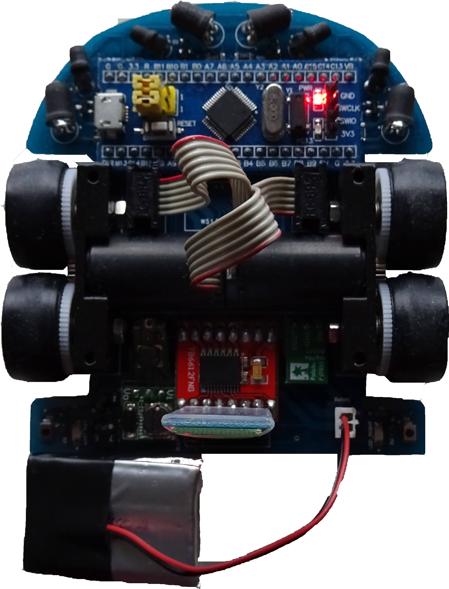{width=50%}

Prototyping
-----------

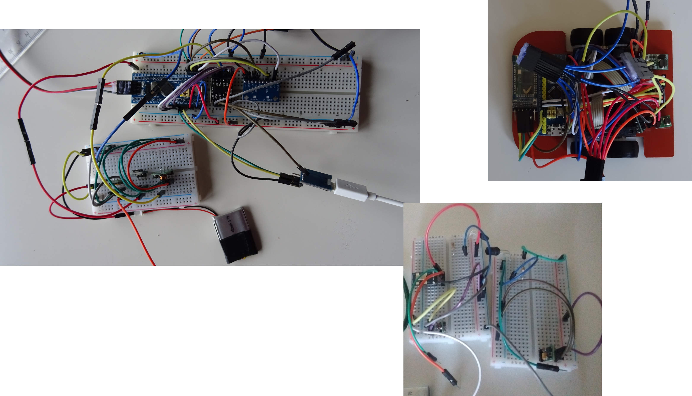{width=90%}

Schematic
---------

{width=100%}

---

<iframe title="Theseus" width="1000" height="650" scrolling="no" frameborder="0" name="Theseus" class="eda_tool" src="https://upverter.com/eda/embed/#tool=pcb,designId=3d82ffa66d538f81,actionId="></iframe>

Soldering
---------

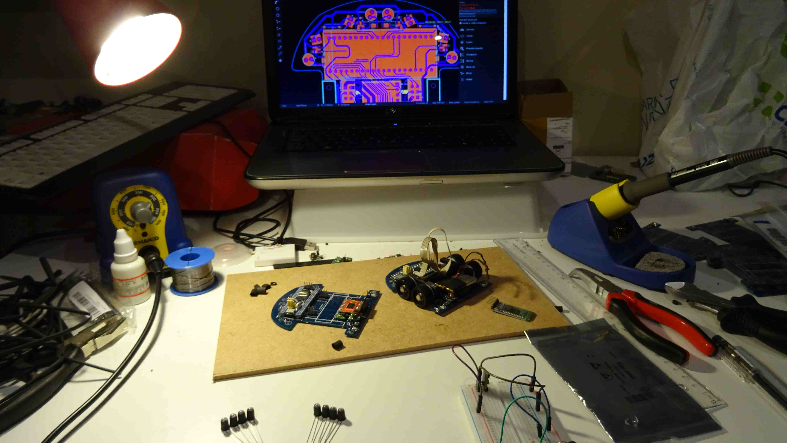{width=85%}

Robot physics
=============

Goals
-----

>- Straight lines
>- Turns
>- :+1: :joy:

Limitations :sweat_smile:
-------------------------

- Acceleration

System
-------

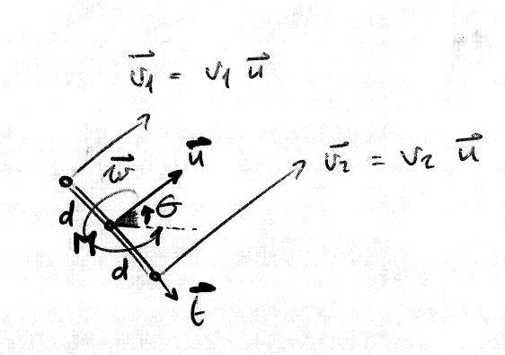

Angular velocity
----------------

$$
\begin{aligned}
\overline{v_2} &= \overline{v_1} + \overline{w} \wedge \overline{r_{21}} \\
v_2 \overline{u} &= v_1 \overline{u} + (w \overline{u_z}) \wedge (2d \overline{t}) \\
v_2 &= v_1 + 2dw \\
\\
w &= \frac{v_2 - v_1}{2d}
\end{aligned}
$$

Linear velocity
---------------

$$
\begin{aligned}
\overline{v_M} &= \overline{v_1} + \overline{w} \wedge \overline{r_{M1}} \\
v_M \overline{u} &= v_1 \overline{u} + (w \overline{u_z}) \wedge (d \overline{t}) \\
v_M &= v_1 + wd \\
&= v_1 + \left(\frac{v_2 - v_1}{2d}\right)d \\
\\
v_M &= \frac{v_1 + v_2}{2}
\end{aligned}
$$

Mechanical design
=================

Wheels... but how many?
-----------------------

---

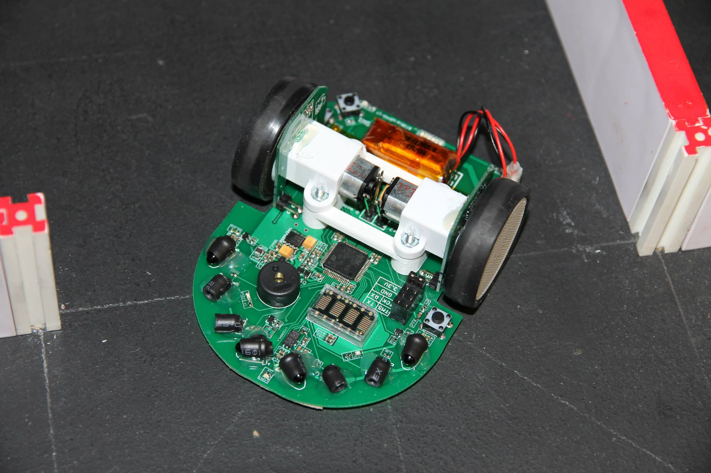{width=80%}

Image taken from [micromouseusa.com](http://micromouseusa.com/wp-content/uploads/2014/03/futura-Cover.jpg)

---

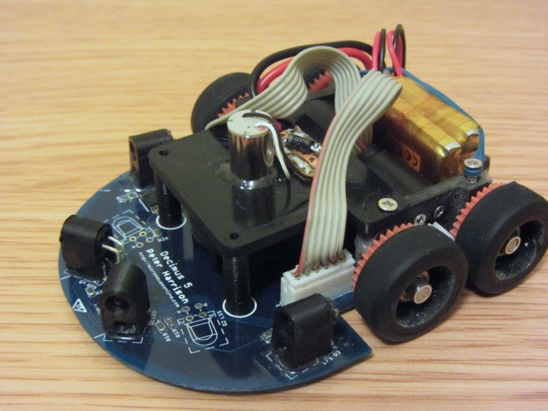{width=70%}

Image taken from [micromouseonline.com](http://www.micromouseonline.com/wp/wp-content/uploads/2017/10/Decimus5A.jpg)

---

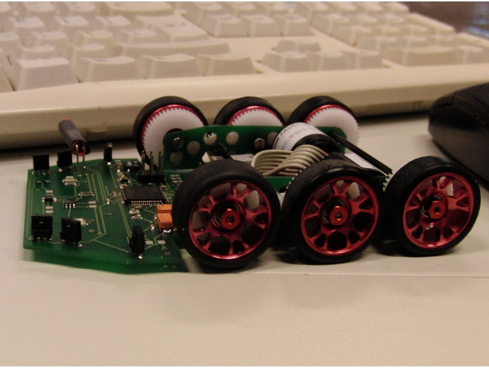{width=70%}

Image taken from [micromouseonline.com](http://www.micromouseonline.com/wp/wp-content/uploads/files/CIMG1994-full.jpg)

---

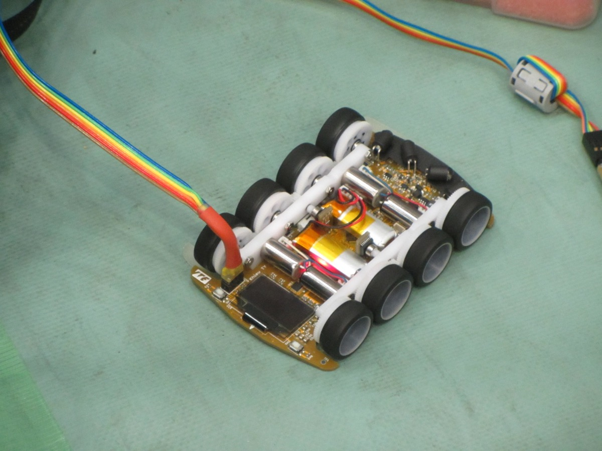{width=70%}

Image taken from [micromouseonline.com](http://www.micromouseonline.com/wp/wp-content/uploads/2015/11/IMG_5761.jpg)

Better start with 4...
----------------------

{width=50%}

[More about "tetra" designs](https://athena-robots.readthedocs.io/en/latest/tetra.html).

CAD designs
-----------

- [Motor mount](https://github.com/Theseus/bulebule/blob/master/3d/mount.py)
- [Rim](https://github.com/Theseus/bulebule/blob/master/3d/rim.py)
- Both designed with [CadQuery](https://github.com/dcowden/cadquery) (Python)
- 3D printed (FDM)

---

---

{width=889 height=500}

Control
=======

Approach
--------

>- Neural networks?
>- State space control?
>- ...

PID! :+1: :joy:
---------------

---

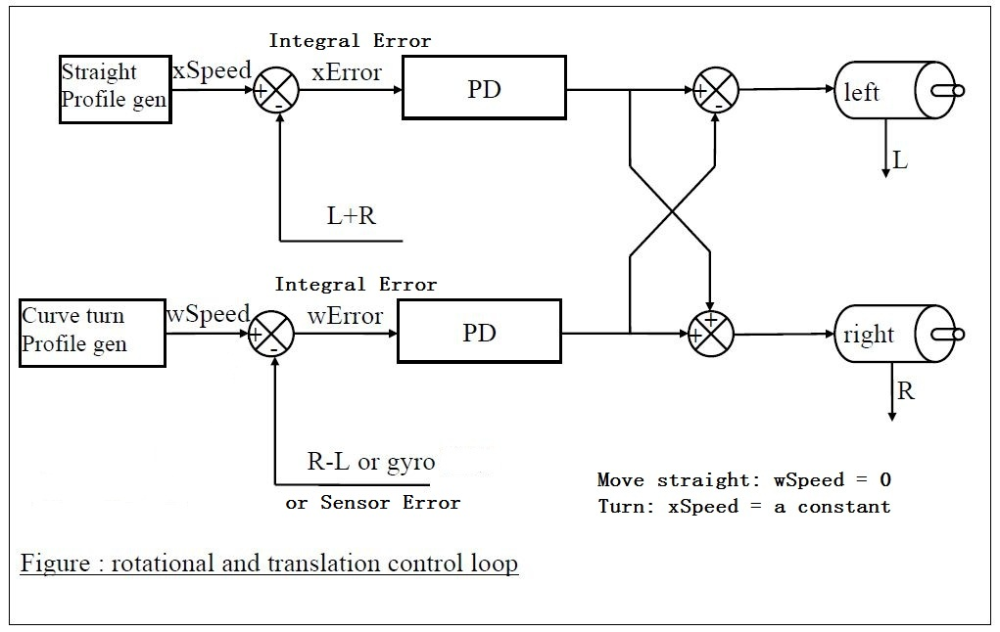{width=90%}

Image taken from [micromouseusa.com](http://micromouseusa.com/) ([Futura Project](http://micromouseusa.com/?page_id=1342))

Characteristics
---------------

- Positional PD (velocity error is integrated)
- PI for sensor error
- [Green Ye's Futura Project documentation :heart_eyes:](http://micromouseusa.com/?page_id=1342)

Speed profile
-------------

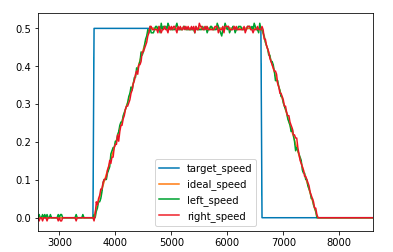{width=60%}

Calculating turns
-----------------

From the motion equations:

$$
\begin{aligned}
\dot{x} &= v_m cos \theta \\
\dot{y} &= v_m sin \theta
\end{aligned}
$$

Considering $\dot{w} \equiv cte.$ and $v_m \equiv cte.$:

$$
\theta = w_0 t + \frac{k}{d} t^2
$$

Discrete integration approximation
----------------------------------

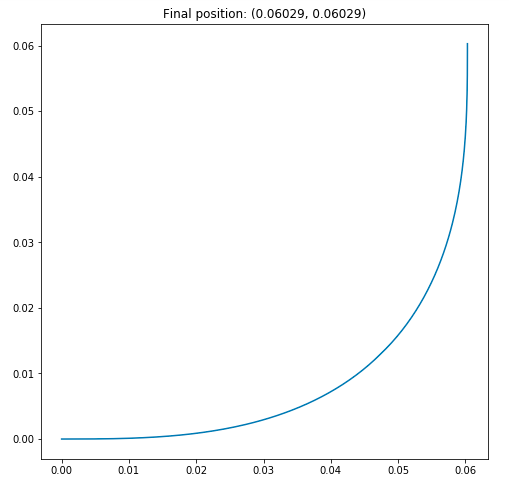{width=40%}

[Notebook in GitHub](https://github.com/Theseus/bulebule/blob/master/scripts/notebooks/dynamic_turns.ipynb)

Maze-solving algorithm
======================

Floodfill :mouse:
-----------------

1. Assume there are no walls
1. Calculate distances to target
1. While goal not reached...
1. Go to the cell that is closest to the target
1. Update distances

Example
-------

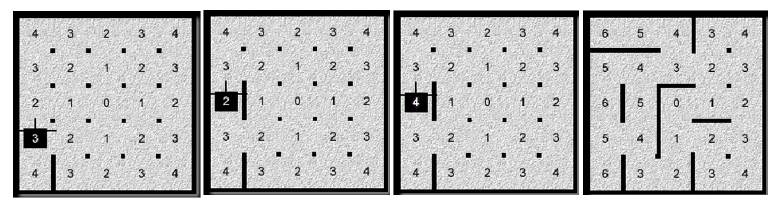{width=100%}

Image taken from [micromouseusa.com](http://micromouseusa.com/) ([Futura Project](http://micromouseusa.com/?page_id=1342))

---

{width=650 height=650}

Implementation details
----------------------

- [Green Ye's Futura Project documentation :heart_eyes:](http://micromouseusa.com/?page_id=1342)

Software design
===============

---

Peripheral | Use 
--- | --- 
ADC1 | Phototransistors
ADC2 | Battery
TIM1 | Sensors state machine
TIM2 | Left motor quadrature encoder
TIM3 | PWM signals for left and right motors
TIM4 | Right motor quadrature encoder
USART | Serial, Bluetooth 
GPIOS | Infrarred emitters, LEDs, buttons
SYSTICK | Control

Sensors state machine
---------------------

- 16 KHz trigger
- Sequentially power on and off 
- 4 states * 4 sensors

Systick
-------

- 1 KHz trigger
- Update ideal speed, encoder, distances
- Motor control 

Main
----

- Setup
- Buttons, debug LEDs
- Side sensors calibration
- Algorithm
- Communication
- Collision detection

Required tools
==============

Hardware
--------

- Battery charger
- Power supply
- Programmer
- Soldering station
- Polimeter
- Logic analyzer
- Oscilloscope

Software
--------

- **C language** - libopencm3, gcc, clang format
- **Python** - notebooks, scripts, communication
- **Continuous integration** - github, travis
- **Reviews & management** - github
- **Documentation** - doxygen, sphinx
- **Board design** - upverter

Maze
----

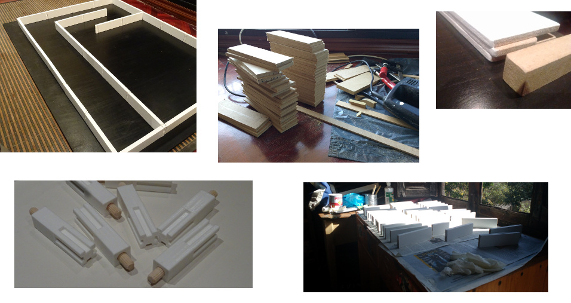

Errors, debugging...
====================

---

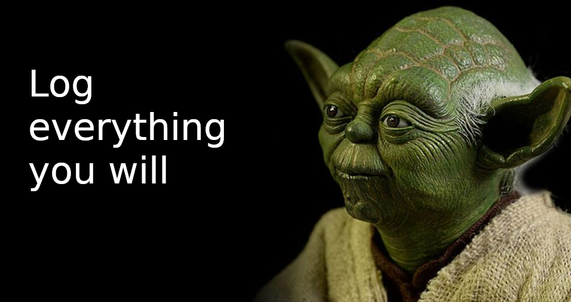 

Eye-opening experience
---------------------- 

{width=80%} 

---

$$
y = e^{\frac{a}{x+b}}
$$

 

More on [micromouseonline.com](http://www.micromouseonline.com/2010/07/07/calibrating-reflective-sensors/)

---

{width=70%} 

---

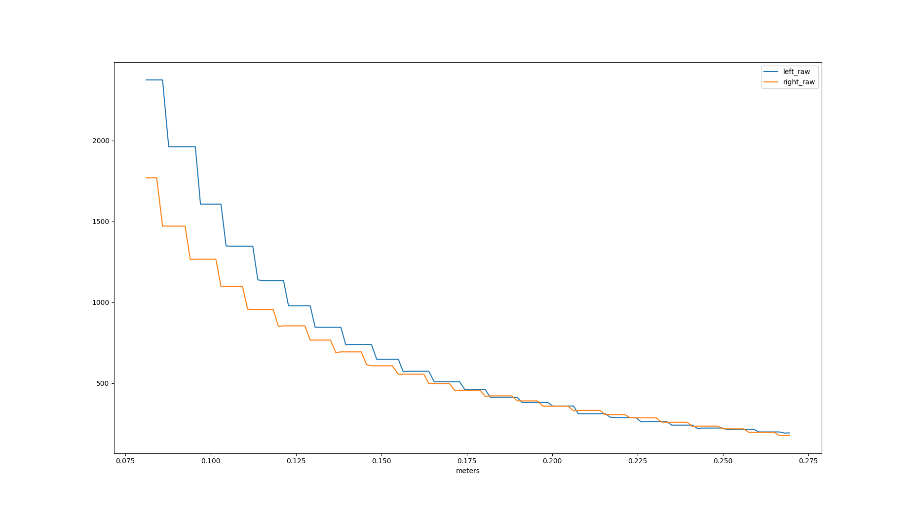

Costs
=====

Very optimistic costs
---------------------

- Around 60 €
- Half is just for motors+encoders (second hand)
- Electronic parts and boards are really cheap (carefully selected)

Realistic costs
---------------

- Lots
- Replacements
- Shipping costs
- More than 100 €
- Not counting tools, maze...

And then...
-----------

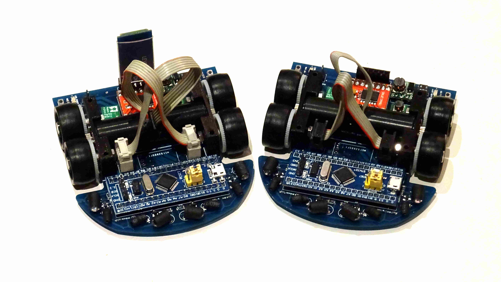

Time... :joy:
-------------

Next stop: Portugal :tada:
==========================

Current state
-------------

{width=889 height=500}

Done
----

- Functional micromouse
- $0.8 ~ m/s$ (straight)
- $0.666 ~ m/s$ (turn)
- $5 ~ m/s^2$
- Only search speed
- Flood fill

TODO
----

- Gyroscope integration (PCB redesign)
- More complete maze exploration
- Path selection
- Fast run
- Diagonals
- New wheels (maybe)
- ~60 issues in GitHub :muscle: :muscle:

Thanks :heart:
--------------

**Green Ye**

: Who shares [details about his micromice](http://www.greenye.net/) and posts many useful resources in [micromouseusa.com](http://micromouseusa.com>)

**Peter Harris**

: Who posts many useful and detailed resources in [micromouseonline.com](http://micromouseonline.com)

**Kato-san**

: Who shares [details about his micromice](http://seesaawiki.jp/w/robolabo/)
  and posts some [useful resources](http://blog.livedoor.jp/robolabo/)

Links :link:
-----

- [https://github.com/Theseus/bulebule](https://github.com/Theseus/bulebule)
- [https://bulebule.readthedocs.io](https://bulebule.readthedocs.io)

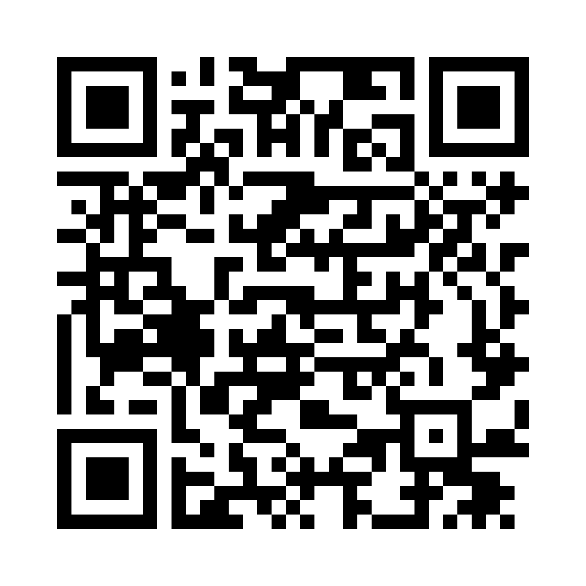{width=40%}
